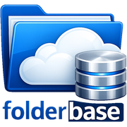

# FolderBase

<p align="center">
  
</p>

**A local-first, metadata-first document manager for macOS.**

[](https://github.com/PaoloSturbini/FolderBase/actions/workflows/ci.yml)
[](https://github.com/PaoloSturbini/FolderBase/releases/latest)
[](LICENSE)
[](https://www.apple.com/macos/)
[](https://www.swift.org/)

FolderBase enriches the real files and folders already stored on your Mac with custom metadata, Kanban views, OCR, hybrid search and optional AI document chat. Its metadata layer works without importing your documents into a proprietary library or modifying their contents.

The interface is available in **English and Italian**. FolderBase is MIT licensed and can be used, inspected, forked and built freely.

**[Visit the website and watch the demo](https://folderbase.pst.my)** · **[Download the latest release](https://github.com/PaoloSturbini/FolderBase/releases/latest)**

> 🇮🇹 Per la documentazione italiana completa, consulta [MANUALE.md](MANUALE.md).

## Why FolderBase?

Traditional file managers expose only basic filesystem attributes. Many knowledge-management tools instead require importing documents into a proprietary database.

FolderBase takes a different approach:

- your files remain in their existing folders;
- metadata is stored separately in a local SQLite database;
- metadata follows files when they are renamed or moved;
- AI features are optional and can run locally;
- disabling AI turns FolderBase into a conventional metadata-first file manager.

## Main features

### Metadata and organization

- Hierarchical custom columns for notes, numbers, dates, Kanban states, colored selects/tags and links: parent-folder configuration is inherited by every subfolder.
- Reusable column templates that reconcile existing subtree metadata and merge configured Select/Kanban options without losing values.
- Persistent inherited column order and visibility, with parent-folder configuration taking precedence on conflicts.
- Faster folder navigation with stale-while-revalidate snapshots, immediate FSEvents refresh and background SQLite reconciliation.
- Progressive loading above 300 entries, incremental table updates, precomputed sort keys and adaptive search debounce.
- Cancellable background table processing: metadata indexes, filtering and sorting no longer block the main UI thread, and stale results are discarded when the folder or query changes.
- A weighted LRU snapshot cache limits both folder count and total retained rows, preventing large directories from causing unbounded memory growth.
- Multi-root sidebar trees with persistent manual root ordering and exact selected-subfolder highlighting.
- Finder-style internal drag and drop: drag files or folders from the table onto a folder row to move them into that folder; hold Option to copy.
- Native table and Kanban board views, with lazy card rendering and single-pass grouping for large boards.
- Filtering, sorting, multi-selection, bulk editing and CSV export.
- Context-menu Markdown links (`file://`) ready to paste into notes.
- Metadata persistence across supported file rename and move operations.
- Notes and structured information attached to real filesystem items.

### Search and optional AI

- Incremental document indexing.
- OCR for scanned PDFs and images.
- Hybrid search combining exact full-text matches and semantic similarity.
- RAG document chat with cited sources and selectable scope.
- Folder-chat scopes are collected recursively in the background before the conversation opens, keeping navigation responsive on large trees.
- Per-file and per-folder AI source exclusions, plus opt-in suggestions for hidden and generated directories; excluded content is filtered from indexing, search and chat even when it was indexed previously.
- Interchangeable providers:
  - Apple on-device embeddings;
  - Ollama for local embeddings and chat;
  - OpenAI using your own API key.
- One master switch disables all AI functionality.

### System integration

- Local SQLite database, backup and restore.
- Optional scheduled backups and database maintenance.
- Launch at login and menu-bar access.
- Light, dark and automatic appearance.
- Adjustable text size and accent color.
- Update checks through GitHub Releases.

## Privacy and data flow

| Component | Where it runs / is stored |
|---|---|
| Original documents | Remain in the folders selected by the user |
| Metadata and index | Local SQLite database on the Mac |
| Apple embeddings | On device |
| Ollama embeddings/chat | Locally, through the configured Ollama instance |
| OpenAI embeddings/chat | Cloud, only when explicitly selected |
| OpenAI API key | macOS Keychain |
| AI disabled | No AI provider is used |

When OpenAI is selected, prompts and relevant document excerpts are sent to OpenAI. For more detail, read [docs/PRIVACY.md](docs/PRIVACY.md).

## See FolderBase in action

The [FolderBase website](https://folderbase.pst.my) includes a short product demo showing the native macOS interface, metadata columns and document workflow.

## Download

Download the latest compiled DMG from:

**[Latest FolderBase release](https://github.com/PaoloSturbini/FolderBase/releases/latest)**

Open the DMG and drag **FolderBase** into **Applications**.

### Signed and notarized release

The distributed build is signed with a **Developer ID Application** certificate
and notarized by Apple. Open the DMG, drag FolderBase into **Applications**, and
launch it normally.

Users who prefer not to run a precompiled build can compile FolderBase directly from source.

## Build from source

Requirements:

- macOS 14.4 or later;
- Swift 5.9 or later;
- a recent Xcode installation or Command Line Tools.

```bash
git clone https://github.com/PaoloSturbini/FolderBase.git
cd FolderBase
swift run --build-path /tmp/folderbase-run FolderBase
```

Convenience scripts:

```bash
./build.sh             # Debug build
./build.sh -c release  # Release build
./run.sh               # Build and run
./make-app.sh          # Create and install the .app bundle
./make-dmg.sh          # Create a distributable DMG in dist/
```

You can also open `Package.swift` in Xcode and run the executable target.

## Technology

Swift · SwiftUI · Swift Package Manager · SQLite/FTS5 · AppKit/FileManager · Vision OCR · FSEvents · SMAppService

## Documentation

- [Italian user manual and technical overview](MANUALE.md)
- [Privacy and data flow](docs/PRIVACY.md)
- [Architecture overview](docs/ARCHITECTURE.md)
- [Contributing guide](CONTRIBUTING.md)
- [Security policy](SECURITY.md)
- [Roadmap](ROADMAP.md)

## Contributing

Bug reports, feature proposals, documentation improvements and pull requests are welcome. Please read [CONTRIBUTING.md](CONTRIBUTING.md) before submitting substantial changes.

Good starting points are issues labelled `good first issue` or `help wanted`.

## Security

Please do not report vulnerabilities through public issues. Follow the private reporting instructions in [SECURITY.md](SECURITY.md).

## License

FolderBase is distributed under the [MIT License](LICENSE).

© 2026 Paolo Sturbini.
